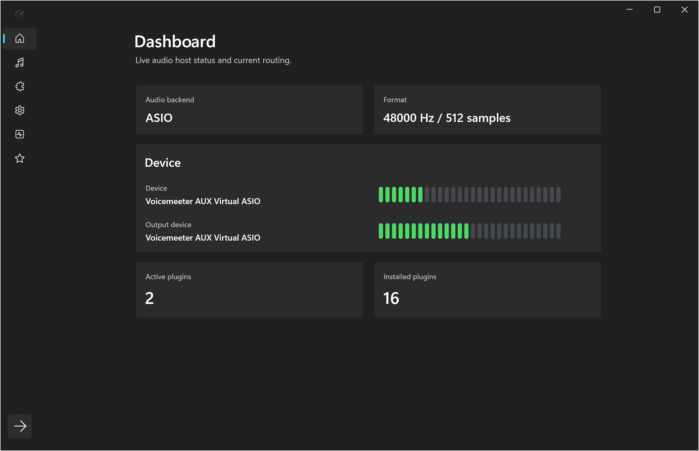
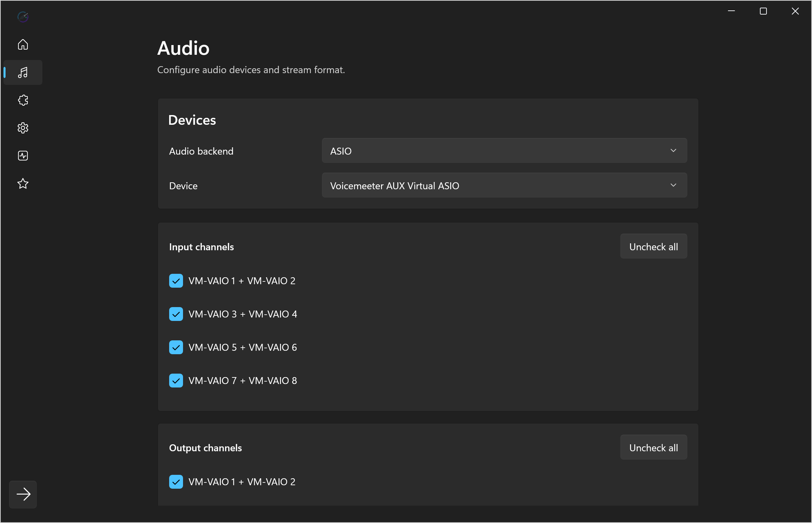
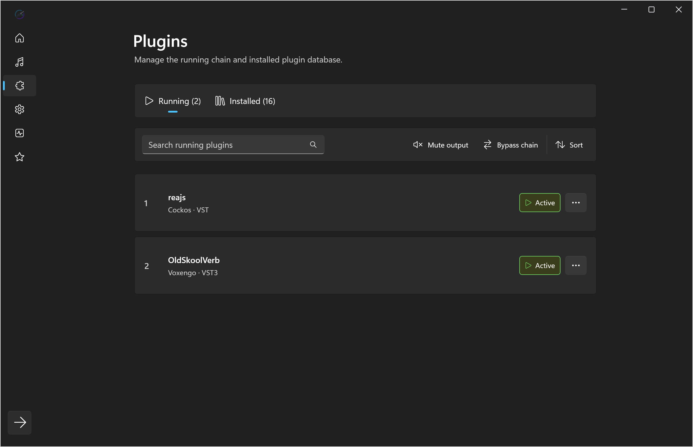
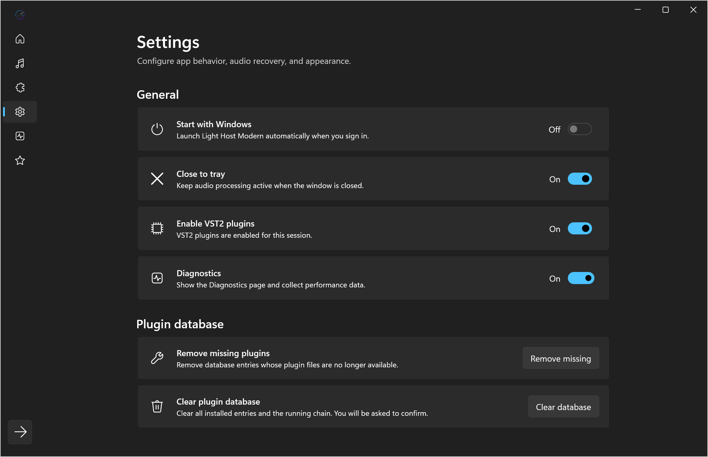
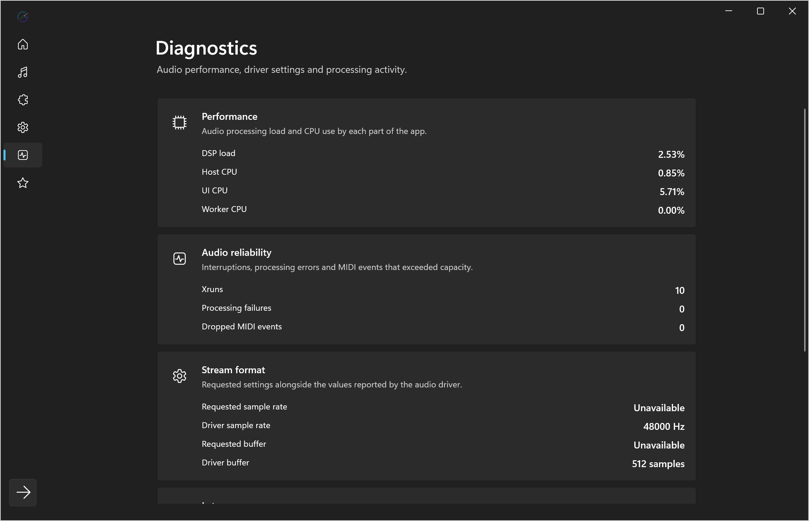

# Light Host Modern

Light Host Modern is a native Windows audio plugin host for running VST3 and optional VST2 effects outside a DAW. It combines a JUCE-based realtime host with a dedicated WinUI 3 interface for configuring audio devices, building a serial plugin chain, monitoring the stream, and keeping processing active from the notification area.

Version **1.3.0** adds isolated scanning, custom plugin names, a redesigned plugin workspace, dedicated diagnostics, and more resilient session storage. See the [changelog](CHANGELOG.md).

## ✨ Features

- Hosts VST3 and optional VST2 audio effects in a serial realtime processing chain.
- Supports Windows Audio, DirectSound, and ASIO backends exposed by JUCE.
- Configures audio devices, input/output channels, sample rate, and buffer size.
- Displays responsive input/output peak meters and plugin counts, with CPU, latency, x-runs, and stream details on the optional Diagnostics page.
- Scans configurable folders in isolated workers, with caching, progress, cancellation, readable failures, and retries.
- Manages Running and Installed plugins through searchable cards, action toolbars, visual status badges, and optional manufacturer grouping.
- Supports multiple instances, reorder, bypass, duplicate, custom names, original-name restoration, details, and editor actions.
- Provides global output mute and latency-compensated chain bypass from Running and the notification area.
- Preserves independent plugin state and names in versioned sessions with atomic writes, backups, and recovery from legacy settings.
- Compensates bypass latency and uses short transitions when toggling bypass or mute.
- Recovers preferred audio devices after startup, sleep, driver restarts, or temporary unavailability.
- Provides compact and expanded layouts, Windows 11 materials, icon variants, JSON localization, and Brazilian Portuguese.
- Runs from the notification area with close-to-tray and current-user startup options.
- Includes safe mode, settings reset, failed-plugin quarantine recovery, installer, and portable packages.

## 🖼️ Demo

## 🚀 Usage

1. Start Light Host Modern and open its interface from the notification area if it is not already visible.
2. Open **Audio** and select the backend, device, channels, sample rate, and buffer size used by the host.
3. Open **Plugins > Installed > Scan for plugins**, add or browse for folders, save each path, and choose **Start scan**. The progress dialog offers cancellation and failure retries.
4. Use an installed card’s **…** menu to **Add to chain**. In **Running**, arrange the processing order and use each card’s menu to open its editor or manage the instance.
5. Review **Settings** for device recovery, startup, close-to-tray, plugin database maintenance, diagnostics, language, layout, material, and icon. Use **Diagnostics** below Settings for detailed monitoring.

For detailed descriptions of the screens, workflows, and internal implementation, see the [application documentation](docs/_index.md).

## ⚙️ Requirements

- Windows 10 version 1809 (`10.0.17763`) or newer; Windows 11 is recommended.
- Compatible 64-bit VST3 plugins, or VST2 plugins when VST2 support is included and enabled.

## ⬇️ Installation

### Recommended installation

Download `LightHostModern-Setup.msi` from the [latest GitHub release](https://github.com/heide-oficial/Light-Host-Modern/releases/latest), open it, and follow the Windows Installer steps. The application is installed under `%ProgramFiles%\Light Host Modern` and receives Start menu and desktop shortcuts. Newer MSI releases upgrade the existing installation; the installer also migrates installations created by the legacy per-user setup.

### Portable version

Download `LightHostModern-Portable.zip` from the [latest GitHub release](https://github.com/heide-oficial/Light-Host-Modern/releases/latest), extract it to a stable folder, and run `Light Host Modern.exe`. The ZIP contains the complete self-contained app and does not use an extraction launcher or PowerShell at runtime.

## 🔒 Privacy and disclosures

- The application does not include telemetry, analytics, advertising, authentication, or user accounts.
- Audio processing, plugin hosting, device enumeration, settings, and host/UI communication remain local to the computer.
- Host preferences and the plugin database are stored locally through JUCE application properties. Chain and plugin state use a separate versioned session file beside those preferences, with atomic writes and recoverable backups.
- WinUI preferences are stored in `%LOCALAPPDATA%\LightHostModern\ui-settings.ini`.
- Debug logs are created under `%APPDATA%\LightHostModern\Logs` only when the host is started with `--debug`.
- The updater contacts this repository’s public GitHub Releases API over HTTPS. It downloads the MSI for installed copies or the ZIP for portable copies, checks the published SHA-256 digest and package identity, and supports cancellation. MSI updates wait for the session to be saved and the app to close; portable updates reveal the verified ZIP for manual extraction. No audio, plugin state, device settings, or personal data is uploaded.
- Diagnostics are local and enabled by default. Disabling **Settings > General > Diagnostics** hides the page and stops diagnostics collection; audio processing and dashboard peak meters continue.
- Enabling **Start with Windows** creates an entry for the current user under the Windows `Run` registry key.
- GitHub and Ko-fi pages open in the default browser only after the user activates their corresponding controls. The Support page displays the Ko-fi banner from Ko-fi's content delivery network.
- The host and WinUI shell are full-trust desktop processes so they can access audio drivers, plugins, local files, the notification area, named pipes, and startup registration.

## 🌐 Supported languages

- English (`1.0.0+`)
- Brazilian Portuguese (`1.2.0+`)

Want to translate Light Host Modern? Copy the [English JSON catalogue](WinUI/LightHost.WinUI/Locales/en-us.json), rename it with the appropriate language code, translate only the values, and submit the file through a pull request or GitHub issue. Missing keys automatically fall back to English. See [Contributing translations](docs/localization.md) for the complete format.

## ❤️ Support

You can support continued development by [donating on Ko-fi](https://ko-fi.com/heide_oficial), [starring the GitHub repository](https://github.com/heide-oficial/Light-Host-Modern), or publishing a video and [submitting it for showcase](https://github.com/heide-oficial/Light-Host-Modern/issues/new?title=%5BSHOWCASE%20VIDEO%5D%20Video%20title%20here&labels=showcase%20video&body=Here%27s%20my%20video%20showcasing%20or%20featuring%20the%20app%3A%20%5BINSERT%20LINK%20HERE%5D).

## 👥 Credits

WARNING: GitHub's automatic Contributors list is based on commit authorship and may not include every person credited above. This section is the project's complete attribution record, including contributions that were reviewed, adapted, or reimplemented before integration.

- Created by [Matheus Heidemann - heide-oficial](https://github.com/heide-oficial).
- Based on the original [Light Host](https://github.com/opencma/LightHost) by [Rolando Islas / OpenCMA](https://github.com/opencma/).
- Built with [JUCE](https://github.com/juce-framework/JUCE), the [Steinberg VST3 SDK](https://github.com/steinbergmedia/vst3sdk), the [ASIO SDK](https://github.com/audiosdk/asio), and optional [Xaymar VST2 headers](https://github.com/Xaymar/vst2sdk).
- [multimattia](https://github.com/multimattia) contributed the [RNNoise VST3 loading fix for plugins with incomplete scan channel metadata](https://github.com/heide-oficial/Light-Host-Modern/pull/4).

## 📄 License

Light Host Modern follows the original Light Host license lineage and is distributed under the [GNU General Public License version 2 or later](license). Third-party components remain subject to their respective licenses and notices.
